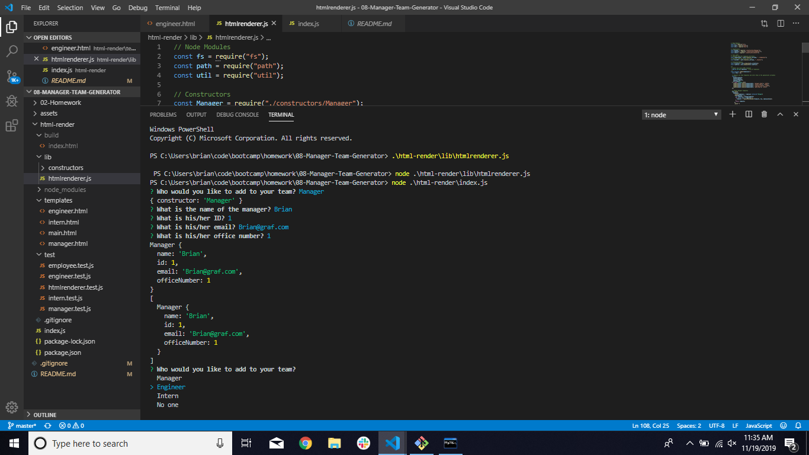

# 08-Manager-Team-Generator
Generates cards for team members of a manager's team

### Table of Contents
- [Description](#Description)
- [Concepts](#Concepts)
- [Technologies](#Technologies)
- [Lanuages-Used](#Languages-Used)
- [Screenshot](#Screenshot)
- [Link](#Link)
- [Resources](#Resources)

### Description

Dynamically generates cards for team members.  This is done using NPM modules, HTML templates, and JavaScript.

User is prompted to construct their team of Managers, Engineers, and Interns.

### Concepts

- #### Template Literals

- #### Tests

- #### Classes

- #### HTML Templates & HTML Generation

### Technologies

- [Bootstrap](https://getbootstrap.com/) - CSS Framework
- [NPM](https://npmjs.com/) - NPM

### Languages Used

- HTML
- CSS
- JavaScript

### Screenshot

### Link

### Resources

https://w3schools.com

https://getbootstrap.com/docs/4.1/getting-started/introduction/

https://developer.mozilla.org/en-US/docs/Web/JavaScript/Reference/Global_Objects/Array/isArray

https://stackoverflow.com/questions/175739/built-in-way-in-javascript-to-check-if-a-string-is-a-valid-number

http://www.asciitable.com/
